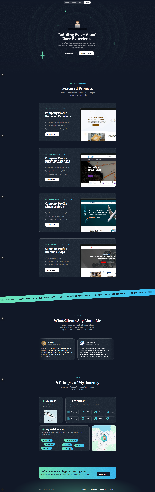

# Portfolio Next.js Project




## Table of Contents

- [Introduction](#introduction)
- [Technologies Used](#technologies-used)
- [Installation](#installation)
- [Usage](#usage)
- [Project Structure](#project-structure)
- [Contributing](#contributing)
- [License](#license)

## Introduction

This is a portfolio project built using Next.js and TailwindCSS. The project showcases various sections including About, Projects, and Contact.

## Technologies Used

- **Next.js 15**: A React framework for production.
- **TailwindCSS 3.4.1**: A utility-first CSS framework for rapid UI development.

## Installation

To get started with this project, clone the repository and install the dependencies:

```bash
git clone https://github.com/raffimh/portfolio-next-raffi.git
cd portfolio-next-raffi
npm install
```

## Usage

To run the project locally, use the following command:

```bash
npm run dev
```

This will start the development server on `http://localhost:3000`.

## Project Structure

The project structure is as follows:

```
portfolio-next-raffi/
├── public/
├── src/
│   ├── assets/
│   ├── components/
│   ├── pages/
│   ├── sections/
│   └── styles/
├── .gitignore
├── package.json
├── README.md
└── tailwind.config.js
```

## Contributing

Contributions are welcome! Please fork the repository and create a pull request with your changes.

## License

This project is licensed under the MIT License.